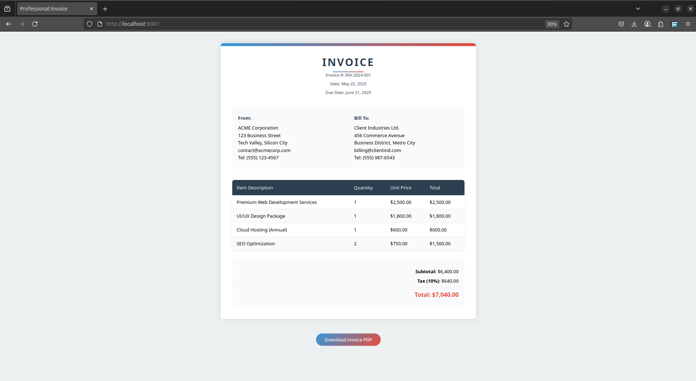

# PDF Downloader Service

A lightweight Go service that converts HTML content to PDF using Chrome headless browser (via `chromedp`). This service provides a simple way to generate professional-looking PDFs from HTML templates with full CSS support.




## 🌟 Features

- Convert HTML/CSS to PDF with full styling support
- Headless Chrome integration via `chromedp`
- Custom page sizes and margins
- Background colors and images support
- Responsive design support
- CORS enabled for cross-origin requests
- Simple REST API

## 🏗 Architecture

The service follows a simple client-server architecture:

```
┌─────────────┐      ┌──────────────┐      ┌────────────────┐
│   Client    │──────►   Go Server  │──────►  Headless      │
│  (Browser)  │      │  (API/Static)│      │  Chrome        │
└─────────────┘      └──────────────┘      └────────────────┘
     ▲                      │                      │
     │                      │                      │
     └──────────────────────┴──────────────────────┘
            PDF Download Response
```

### Components

1. **Frontend**:
   - HTML template (`index.html`)
   - CSS styles (`styless.css`)
   - JavaScript client (`script.js`)
   - Handles content preparation and PDF download

2. **Backend**:
   - Go server (`main.go`)
   - REST API endpoint
   - Static file serving
   - PDF generation using [`chromedp`](https://pkg.go.dev/github.com/chromedp/chromedp@v0.13.6)

3. **PDF Generation**:
   - Headless Chrome instance
   - HTML to PDF conversion
   - Custom page settings

## 🚀 Getting Started

### Prerequisites

- Go 1.24 or higher

### Installation

1. Clone the repository:
```bash
git clone git@github.com:Pascal1812/pdf_downloader.git
cd pdf_downloader
```

2. Install dependencies:
```bash
go mod pdf
```

3. Run the server:
```bash
go run main.go
```

The server will start at `http://localhost:8080`

## 💻 API Reference

### Generate PDF

```http
POST /api/generate
Content-Type: application/json

{
    "html": "<your-html-content>"
}
```

#### Request Body

| Parameter | Type     | Description                |
|-----------|----------|----------------------------|
| `html`    | `string` | Complete HTML content with embedded styles |

#### Response

- Content-Type: `application/pdf`
- Content-Disposition: `attachment; filename=invoice.pdf`

## 🤝 Contributing

Contributions are welcome! Please feel free to submit a Pull Request.
